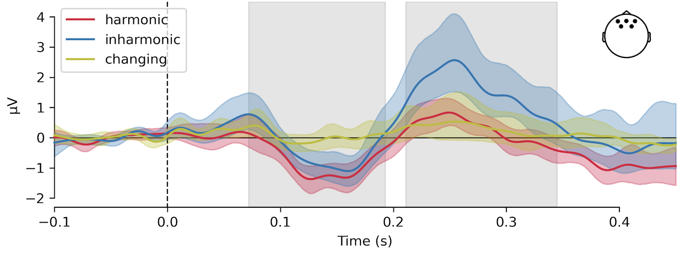
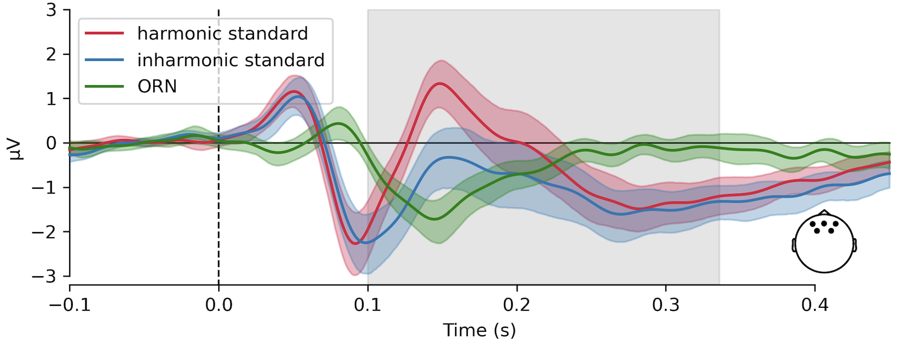

+++
title = 'New preprint available!'
date = 2025-04-30T11:41:01+02:00
draft = false
+++

Excited to announce a new study from my time at the Center for Music in the Brain, Aarhus University, now available on bioRxiv!

Inharmonicity enhances brain signals of  attentional capture and auditory stream  segregation

[www.biorxiv.org/content/10.1...](https://www.biorxiv.org/content/10.1101/2025.04.17.649377v2)

Many sounds that are important for humans are harmonic complex tones. These include speech, animal calls or sounds of musical instruments. Inharmonic sounds are often described as noises, crackles, pops etc.

Harmonicity is an important property for sound perception and it influences pitch processing, memory or hearing in noisy environments. However, it’s unclear how the brain processes harmonic and inharmonic sounds.

In this study we used EEG to record MMN and P3a mismatch responses - markers of auditory prediction error. Inharmonic sounds with a constant jittering pattern generated similar MMN and stronger P3a responses than harmonic sounds.

In contrast, MMN responses became undetectable when the jittering pattern changed between consecutive sounds. This suggests that prediction errors are weighted by sequential but not spectral uncertainty.

Unexpectedly (and excitingly!), inharmonic sounds had significantly smaller P2 peaks than harmonic sounds - a response pattern known as object-related negativity, previously observed with auditory stream segregation.

I'm super-grateful to my co-authors: Sánder, 
[David Quiroga](https://bsky.app/profile/did:plc:d7b5wer3delweih42v6gedag) and Peter for all their hard work.

We’re now following up on this study in many different ways here in Gdańsk. 

_Chris_