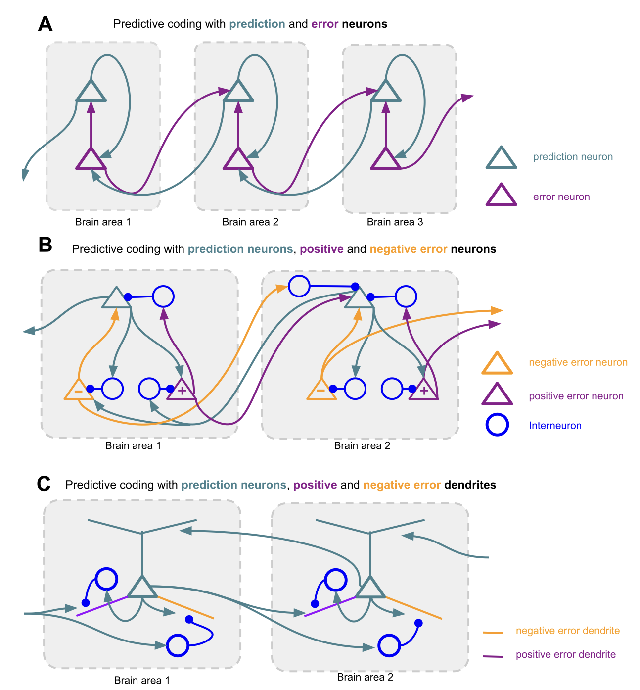
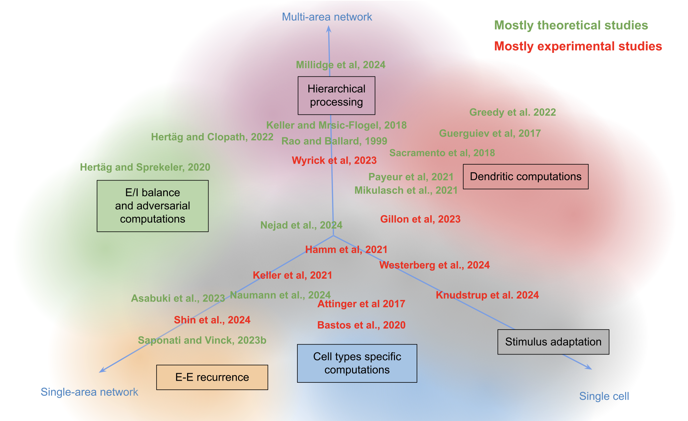
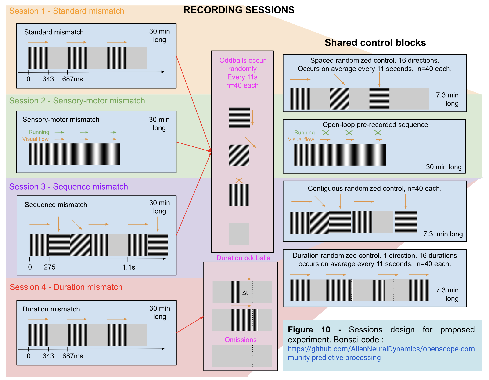

+++
title = 'Neural mechanisms of predictive processing - an OpenScope collaboration'
date = 2025-05-07T12:39:48+02:00
draft = false
+++

Recently I had a chance to contribute to a [review paper](https://arxiv.org/abs/2504.09614) on the neural mechanisms of predictive processing, coordinated by the [Allen Institute for Neural Dynamics](www.allenneuraldynamics.org). This wonderful initiative aimed at providing a review of current theoretical models and experimental evidence on mechanisms of predictive processing. 

Additionally, the authors proposed a set of experiments that are aimed to test, if different kinds of mismatch stimuli engage similar or different predictive mechanisms. These experiments will now be performed by [OpenScope](https://www.allenneuraldynamics.org/projects/openscope) and a consortium of labs, in mice and primates.

The entire project was a collaborative community effort in the spirit of open science. The whole process was coordinated [Jerome Lecoq](jeromelecoq.bsky.social) at the Allen Institute and was incredibly open and inclusive - literally _everyone_ had a chance to contribute. I really think that this is how science should be done, especially since there are no real reasons why it shouldn't (apart from researcher egos!). It was a great experience and I have learned o lot by taking part.

The preprint of the review article is available at arXiv here: [https://arxiv.org/abs/2504.09614](https://arxiv.org/abs/2504.09614).

_Chris_