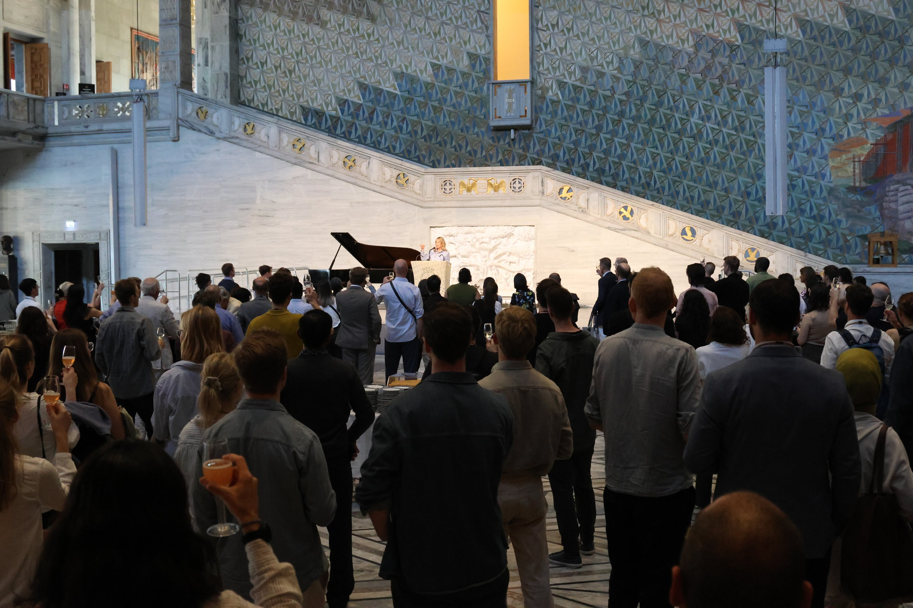
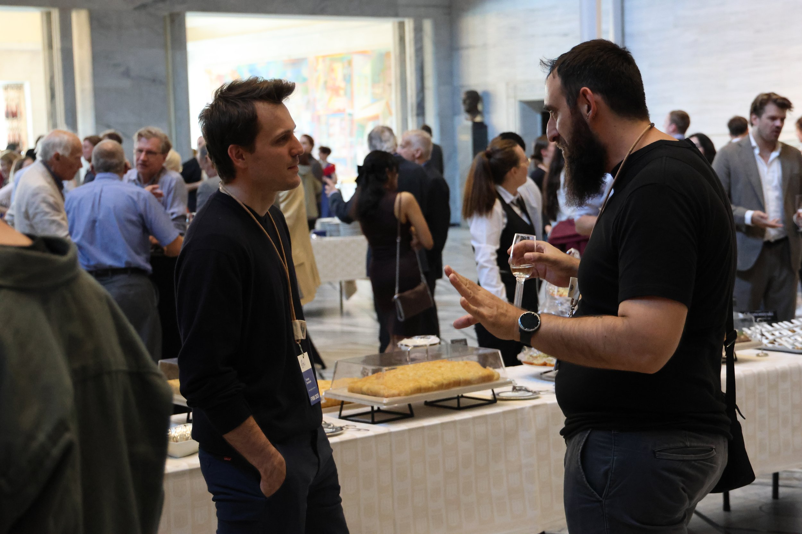
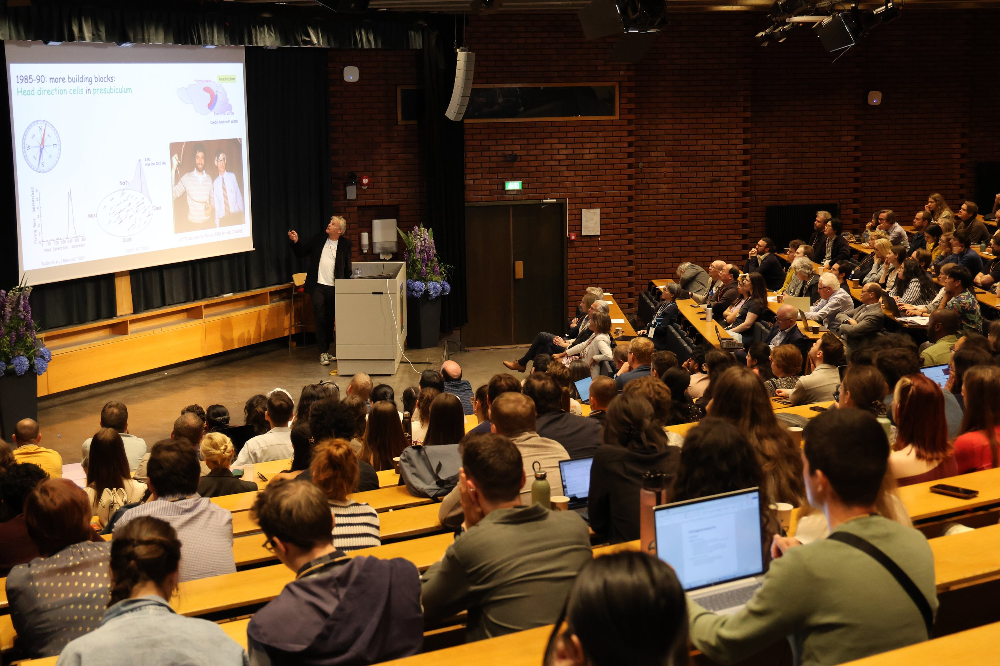
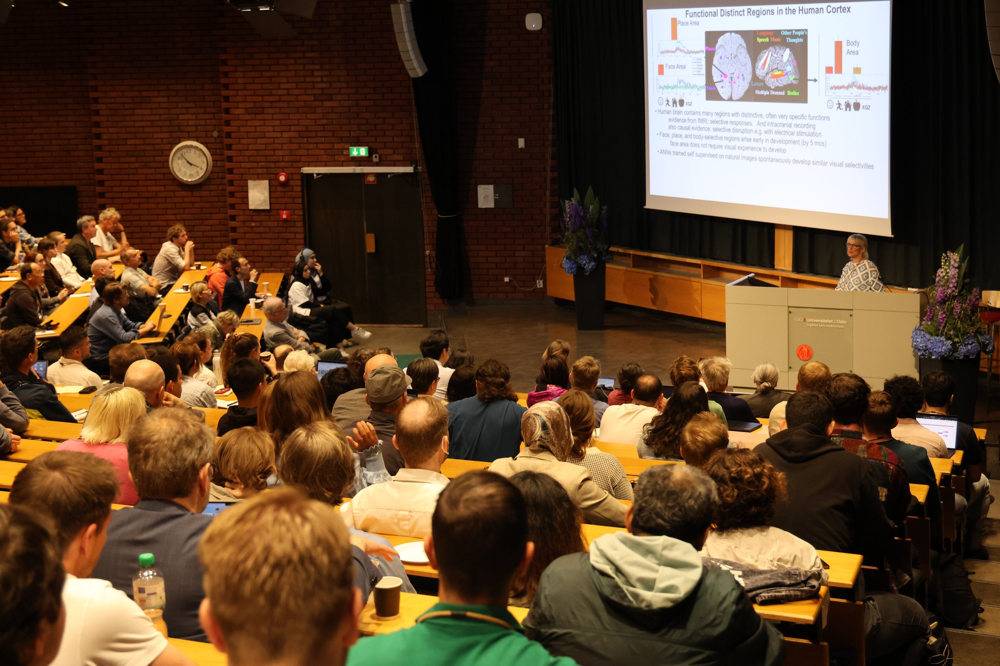
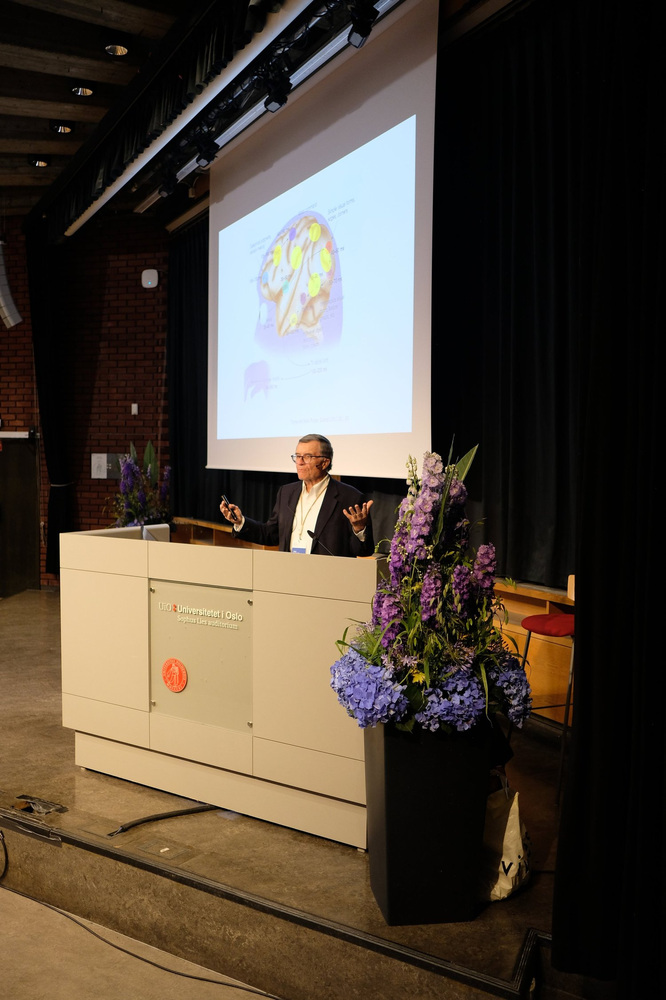
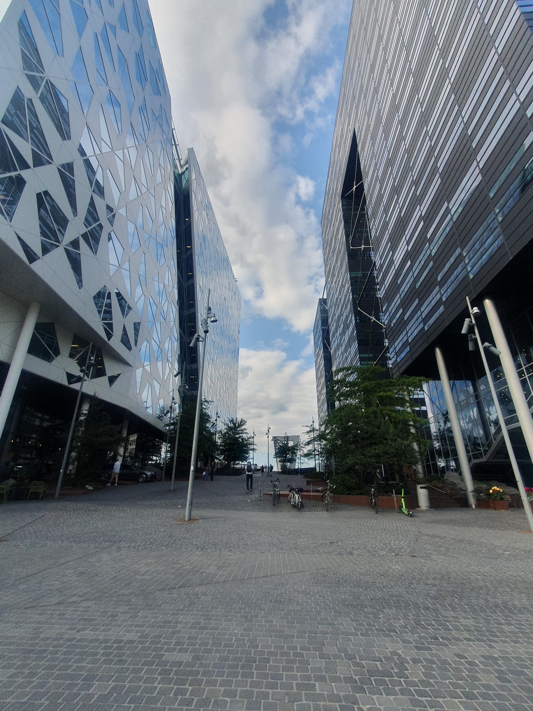

+++
title = 'ANLab at FENS2025 in Oslo'
date = 2025-06-25T14:40:44+02:00
draft = false
+++

Tomek recently attended the [FENS Regional Meeting](https://www.frm2025oslo.no) in the city of Oslo, Norway. The FENS brings together neuroscientists from all around the globe, and as usual, this year’s meeting welcomed the remarkable diversity of modern neuroscience – from Neuropharmacology and Neuroimmunology to Neural Circuits, Cognitive Neuroscience, and Computational Neuroscience.

Over 500 posters were presented during four intensive days filled with research using both animal and human models. We had the chance to attend inspiring talks from some of the most distinguished researchers in the field, including Nobel Prize laureate Edvard Moser, Kavli Prize laureate Nancy Kanwisher, and Brain Prize laureate Terry Sejnowski.

Tomek presented his preliminary results from his current PhD project, exchanged ideas and discussed future directions with our colleagues from the RITMO Center at the University of Oslo.

Even though the programme was packed with science, social activities were there as well! We attended welcoming reception at Oslo City hall and spent lovely evening at a BBQ dinner in the center of the UiO campus. All in all, the meeting was wonderfully organized and we look forward to the next FENS meeting in Barcelona! 

