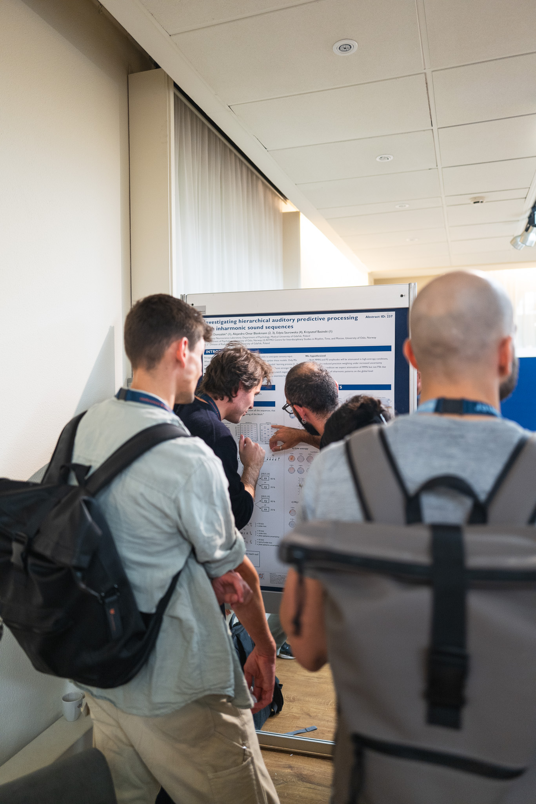
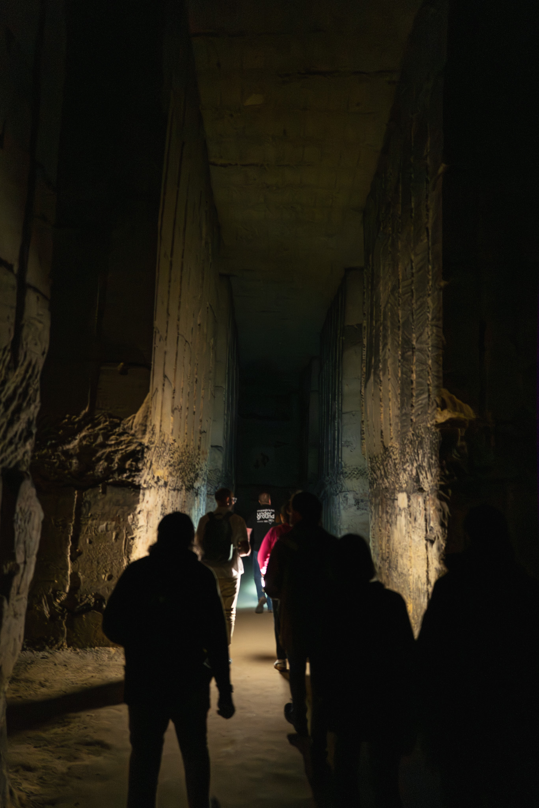
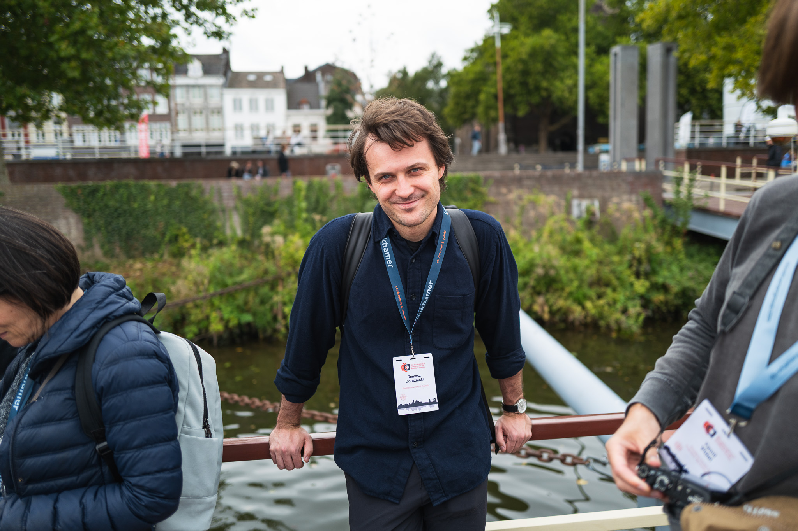
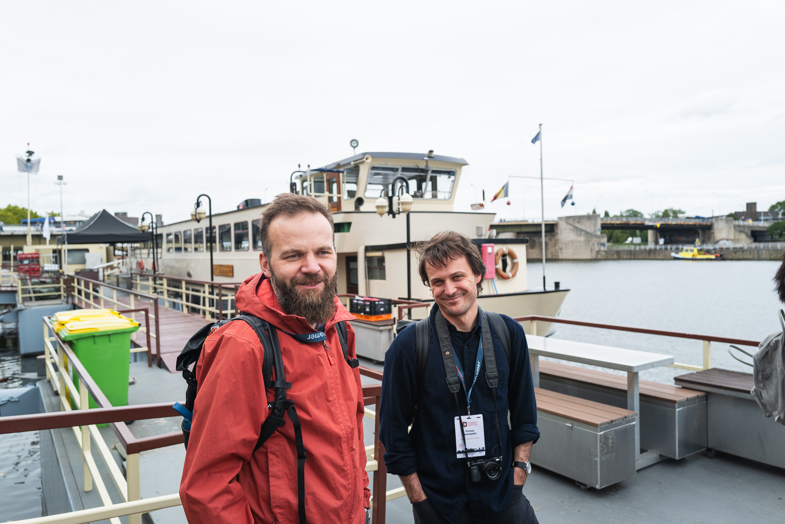
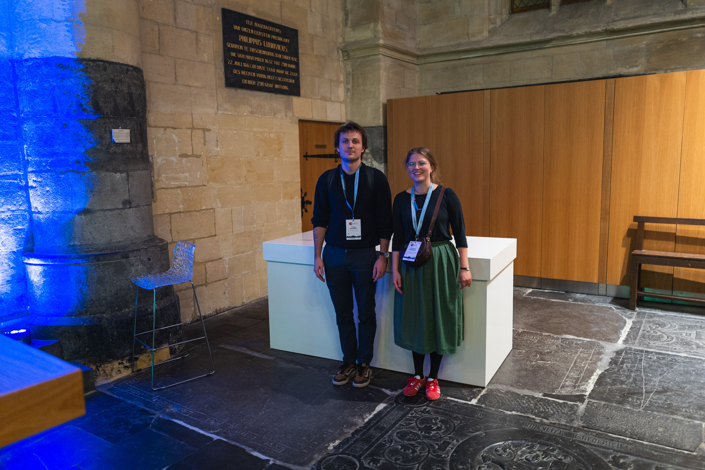
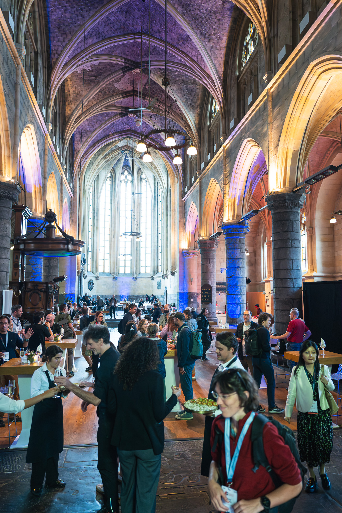

+++
title = 'ANLab at ICAC2025 in Maastricht'
date = 2025-10-01T14:40:44+02:00
draft = false
+++

Chris and Tomek recently attended the [International Conference on Auditory Cortex](https://www.maastrichtuniversity.nl/icac2025/international-conference-auditory-cortex) in the beautiful Maastricht in the Netherlands. ICAC is a conference that brings together researchers interested in the auditory cortex. A specific aspect of ICAC is that it brings together scientists working with different species (including humans!). This cross-species focus is especially exciting, as it offers great opportunities for translation of animal results to neuro-cognitive models in humans.

ANLab's work was shown during two Poster sessions. Tomek presented his preliminary results with the local-global paradigm while Chris presented (almost) final results on the multi-feature deviants study. 

Apart from the wonderful scientific program, there were many cool social activities. We explored caves that turned out to be mines that turned out to be quarries. We sailed on boats. We dined in a gothic church and had fun listening to a live band. Congrats to the organizers for putting all of this together into an exciting experience. We look forward to next ICAC in Magdeburg!

