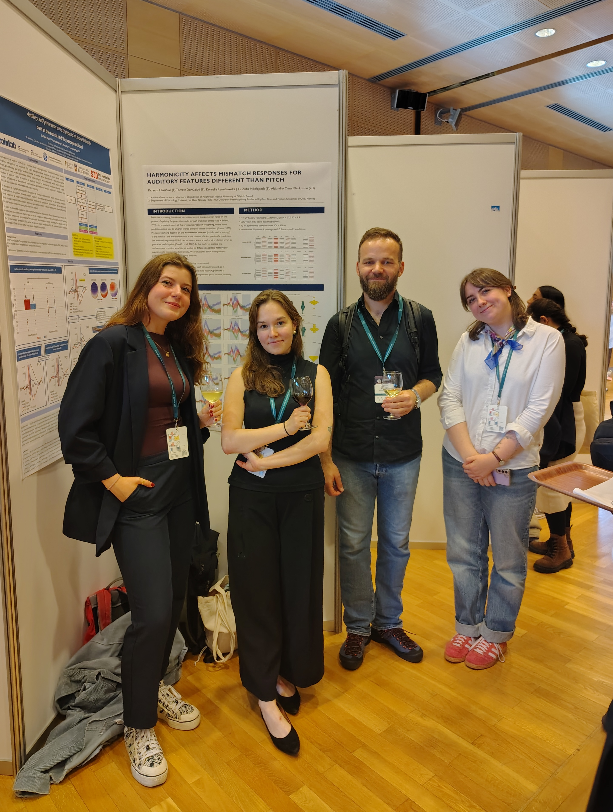
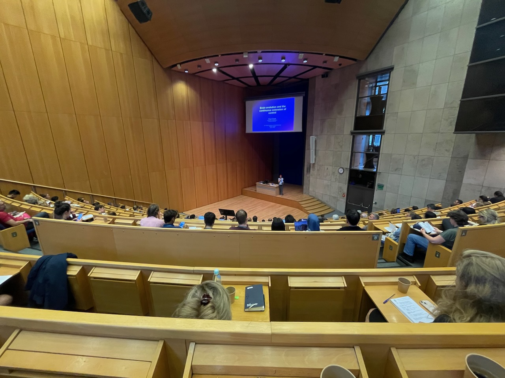
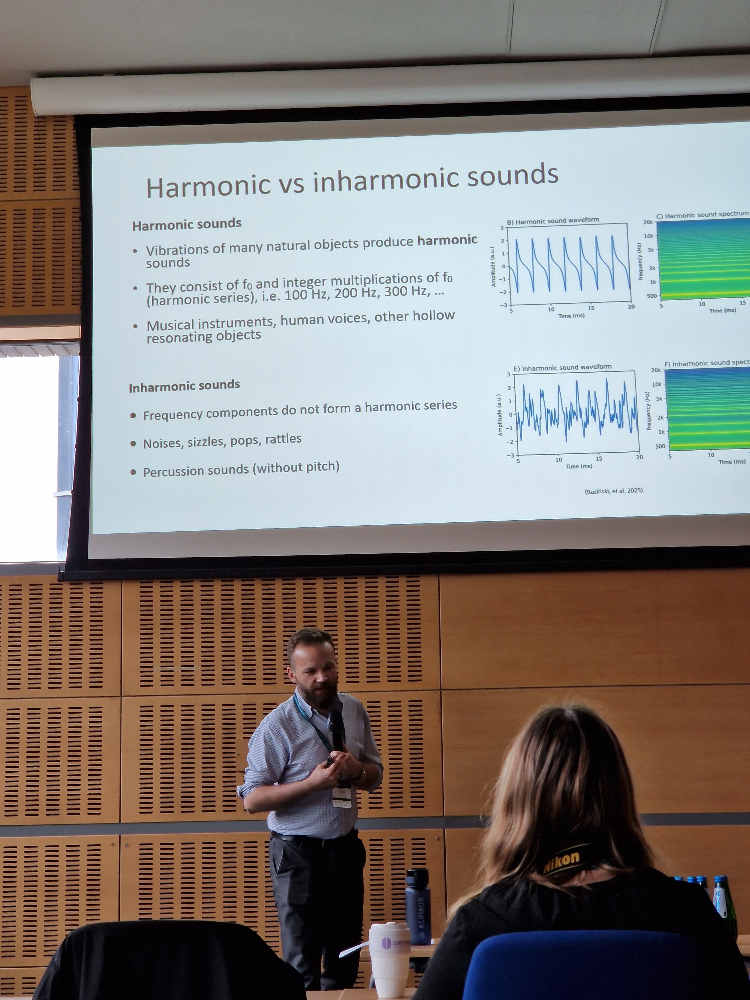
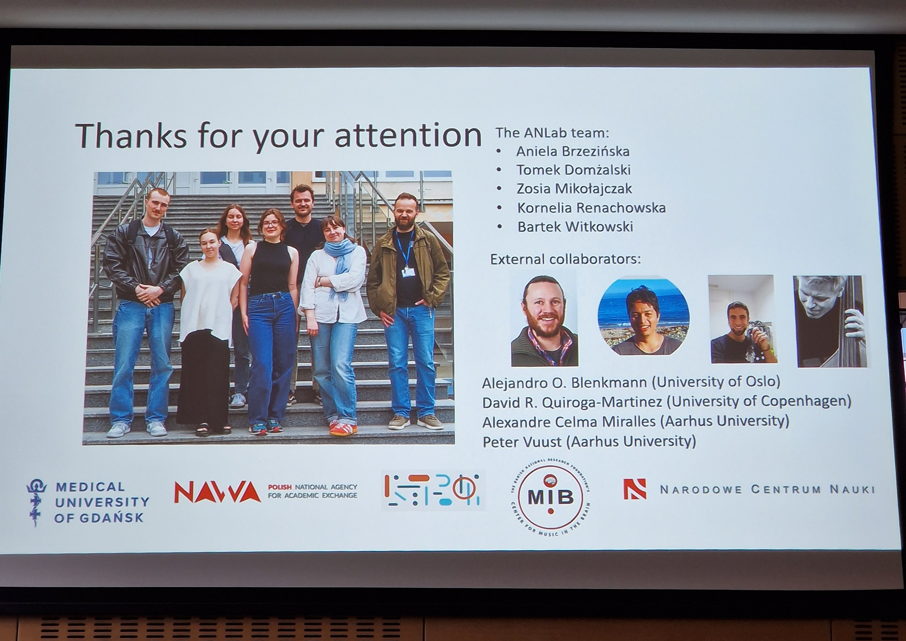

+++
title = 'ANLab at IOP2025 in Kraków'
date = 2025-07-17T14:08:27+02:00
draft = false
+++
Highlights from our July conference trip!

The Auditory Neuroscience Laboratory had the pleasure of attending the 22nd World Congress of Psychophysiology in Kraków, Poland. We had tons of fun, met interesting people and learned many new things.

Together with [Marcin Leszczyński](https://scholar.google.com/citations?user=O-mtQkIAAAAJ), Chris put together a symposium entitled "Psychophysiology of predictions". Marcin, Chris, along with [Vasiliki Kondyli](https://scholar.google.com/citations?user=9L1BULkAAAAJ), [Renate Rutiku](https://scholar.google.com/citations?hl=pl&user=_NpRFdHqG7AC) and [Jakub Szewczyk](https://scholar.google.com/citations?hl=pl&user=C6Yltn8AAAAJ) discussed various aspects of predictions, focusing on different processes (vision, audition, somatosensory, linguistic) and different neuroimaging modalities (behavioral, EEG, iEEG, eye-tracking, MEG).

We also presented two research posters, sharing our latest findings. Aniela showed results from her Masters thesis, showing a peculiar modulation of mismatch negativity by different amounts of inharmonicity (stay tuned, preprint is almost ready!). Kornelia and Zosia showed results form a multi-feature deviant study that is currently in preparation.

Aniela's poster was recognized with the Best Poster Award, which we are especially honored by - thank you to the award committee, organizers and all who stopped by for a chat!

